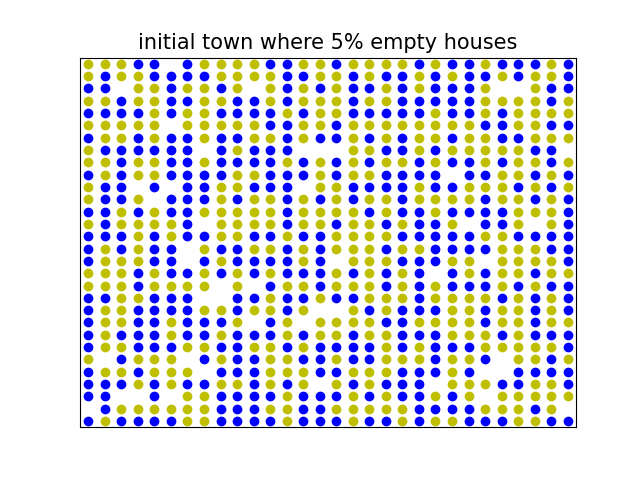

# schelling-model
implementation of the Schelling model that allows you to play with different parameters to understand the model visually.
(parameters like the percentage of the empty houses/thresholds/races percentage)
example:

